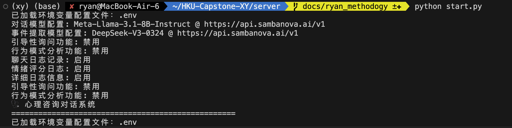
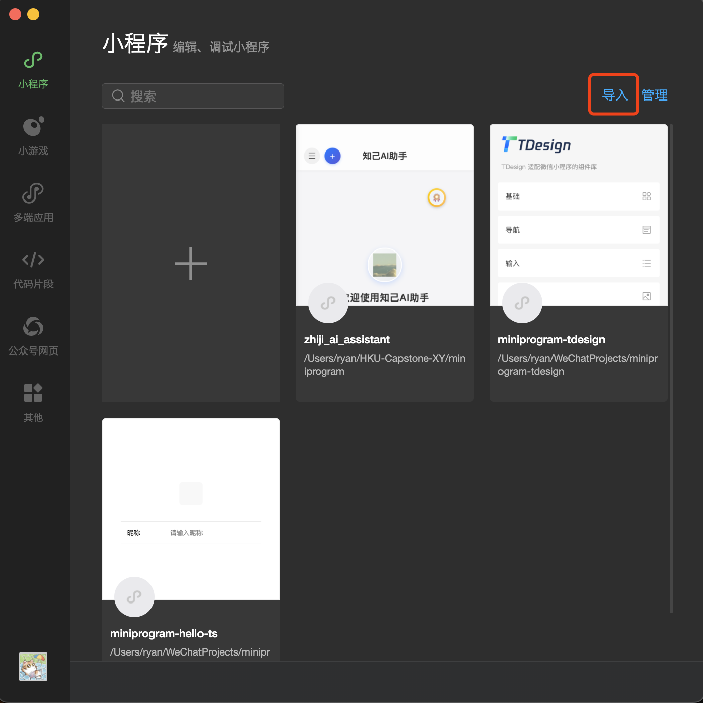
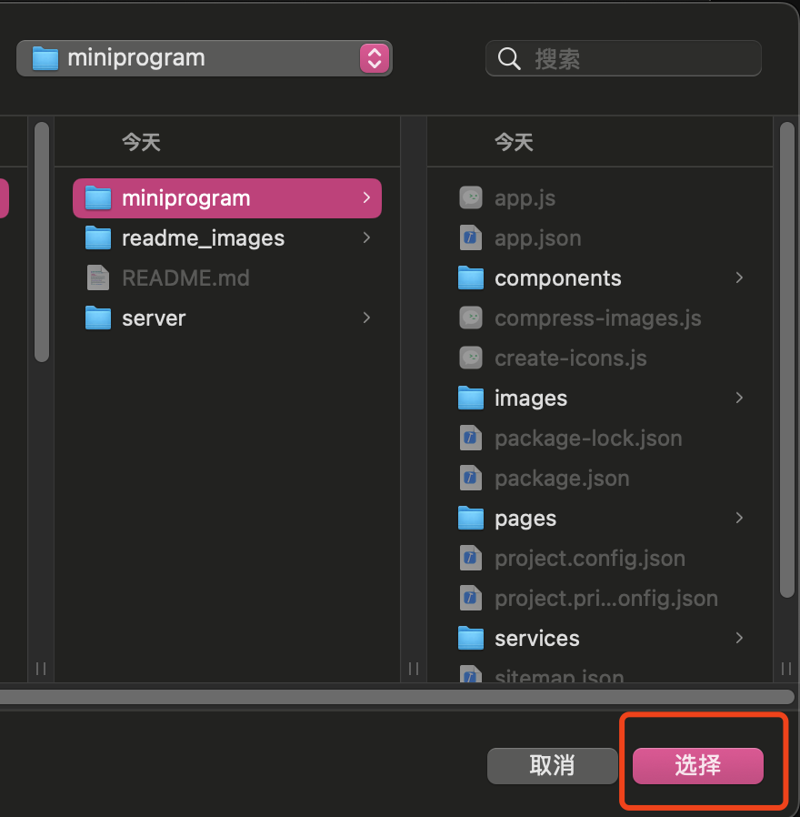
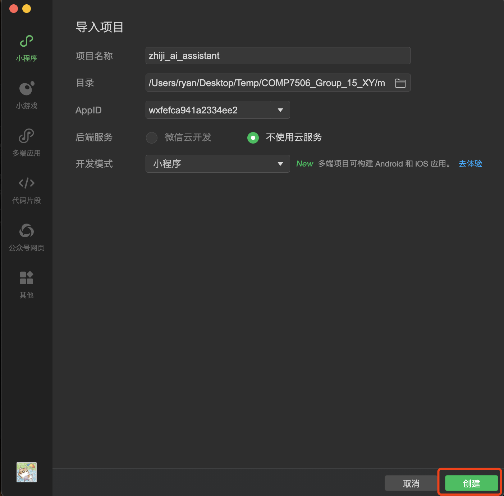
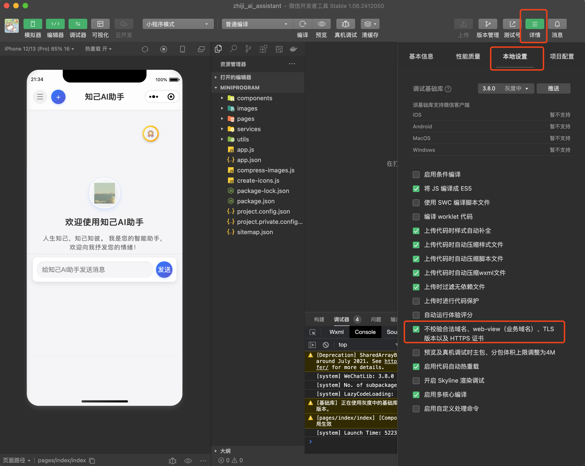
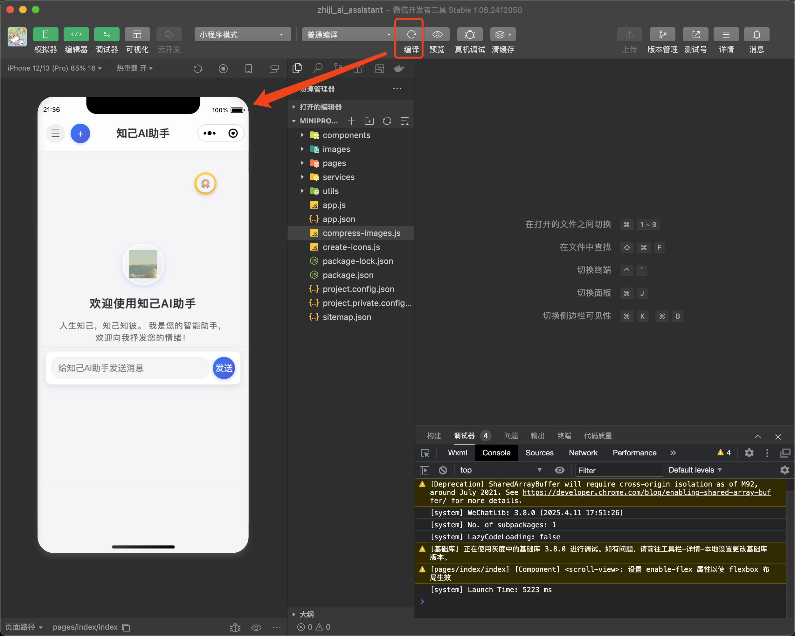

# Introspection Agent (知己AI助手)

AI-Powered Chatbot for Mental Health.

## Quick Start

### Back-end

1. Requirement

- Python 3.11+

- OpenAI API KEY (for demonstration purposes, you can use the temporary key in /server/.env.example, but this key will expire in the future)

- SERPAPI_KEY (for search feature, and for demonstration purposes, you can use the temporary key in /server/.env.example, but this key will expire in the future)

2. Install dependencies

```bash
cd server
pip install -r requirements.txt
```

3. Configure environment variables

Copy the environment variable example file and configure it:

```bash
cp .env.example .env
```

4. Start the server

```bash
python start.py
```

The server will run on http://localhost:5858 by default.



### WeChat Miniprogram

1. Requirement

- IDE [WeChat developer tools](https://developers.weixin.qq.com/miniprogram/dev/devtools/download.html)

- Miniprogram AppID (For demonstration purposes, you can use the temporary AppID: "wxfefca941a2334ee2", in /miniprogram/project.config.json)

- Import the program by file path





2. Run the project

- Enable the "Do not verify legal domain name" option (otherwise you cannot access the local test port <http://localhost:5858>)



- Click the "Compile" button in WeChat developer tools



- Wait for the compilation to complete and you can experience it

If you encounter any problems, feel free to contact:

- Chen Yuan (<ryan.chenyuan@connect.hku.hk>)
- Xu Hanlin (<hallymxu@gmail.com>)
- Yu Yitao (<yitao_yu2024@connect.hku.hk>)
- Su Yingcheng (<suyingc@connect.hku.hk>)
- Wang Xueyao (<xywang5@connect.hku.hk>)

