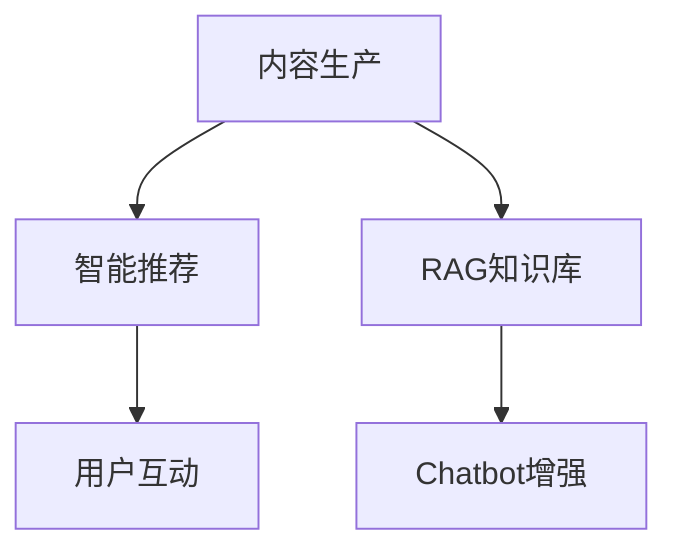
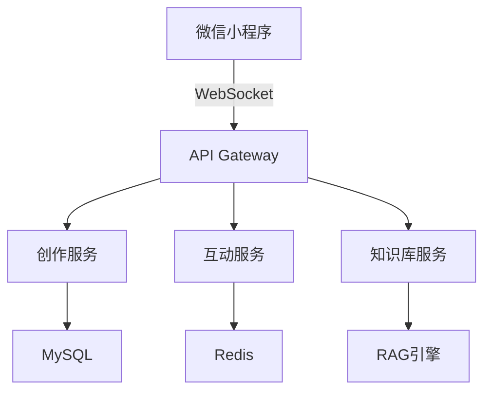
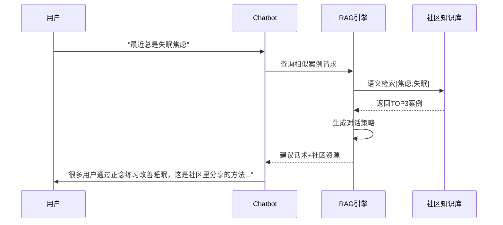

# Detailed Proposal Draft

---

## 1. Background

### 1.1 心理咨询市场

- **供需失衡**：中国心理咨询师缺口大，单次咨询费用普遍在500-1000元区间，形成高门槛服务。
- **地域限制**：专业资源集中在一线城市集中，二三线城市用户获取服务困难。
- **认知滞后**：潜在需求者因"病耻感"回避线下咨询。

### 1.2 竞品报告

- **情智星球**：<https://www.sohu.com/a/830612921_122042791>
- **AI心语**：<https://news.qq.com/rain/a/20241106A09XWS00>

### 1.3 AI's scope

#### Pros

1. **颠覆性的成本结构**：以DeepSeek模型价格为例，每百万Token仅需几块钱，远低于人类心理咨询师价格。且不受地点、时间安排等限制。
2. **实时情绪响应**：7x24在线提供情感支持和安慰，帮助青少年表达和理解自己的情绪。
3. **信息和资源提供**：提供关于心理健康、应对策略等方面的信息。

#### Cons

1. **深层次的情感问题**：如创伤处理、深层次的自我认同问题等，需要专业心理咨询师的介入。
2. **紧急情况**：如自杀倾向、严重的心理危机等，需要即时的专业干预。
3. **法律和医学问题**：如家庭暴力、严重精神疾病等，需要专业的法律和医学介入。
4. **用户认同问题**：LLM无法实现人与人之间的情感链接，用户可能主观上不愿与AI交流心理问题。

## 2. Our Scope

### 2.1 不做什么

| ​**Item**​                     | ​**Description**​                                                                                   |
|-------------------------------|---------------------------------------------------------------------------------------------------|
| ​**模型优化**​          | 专注于用 LLM 的能力提供心理咨询服务，而不是训练用于心理咨询的大模型。                            |
| ​**语音**​ | 文字与语音的转化是一个专业性很强的领域，本项目提供基于文本的回复。                               |

### 2.2 做什么

### 不做TTS(Text to Speech)

### 做倾听者

AI倾听情绪输出，给予情绪肯定。

### 做内容社区

由用户发帖驱动的日常case、心理学习资源、咨询经历分享。

匿名树洞 + AI情感共鸣 ： 用户可以分享自己的心理困扰、日常情绪或成长故事，LLM 自动生成鼓励性回复或建议（比如“你最近感觉焦虑，试试深呼吸或写日记吧”）。
示例：发布“职场压力”故事的用户，会收到AI整理的相关CBT技巧，并进入“打工人互助小组”聊天室。

### 做评测工具：心理量表

## Object & Metric

针对心理咨询AI Agent的功能设计，以下是各模块可量化的指标及设计目标建议
=======

| ​**Item**​                     | ​**Description**​                                                                                   |
|-------------------------------|---------------------------------------------------------------------------------------------------|
| ​**心理对话 Chatbot**​    | 根据来访者的需求提供倾听和咨询服务。                                                             |
| ​**心理内容社区**​        | 由用户发帖驱动的日常生活、心理学习资源、咨询经历分享。                                           |
| ​**心理评测工具**​        | 自动检测实时情绪水平，主动评测心理量表。                                                         |
| ​**隐私政策合规**​          | 参考 HIPAA/GDPR 合规框架标准，实现所有场景的隐私政策覆盖和数据脱敏。                             |

>>>>>>> 8df9d816d17a197e7bb6f616283f6aadb2b0884c

---

## 3. Design(包括工作量评估)

### 3.1 AI 对话

TODO(@yuyitao)

### 3.2 社区

#### 核心功能架构



#### 功能实现细节

##### 核心功能模块

| 功能维度     | 核心能力说明                                          | 预计工作量    | 预计交付  |
| ------------ | -------------------------------------------------- |------------ |------------ |
| **内容创作** | 支持富文本+匿名模式编辑，支持富文本展示                  | 4 week | Progress 1 April 7 |
| **社区互动** | 匿名点赞/评论系统                                     | 4 week | Progress 2 May 5 |
| **智能推荐** | 基于用户心理画像的个性化推荐（结合实时情绪状态+长期兴趣标签） | 4 week | Progress 3 June 16 |
| **知识沉淀** | 自动生成结构化案例库，用于增强 Chatbot 对话效果           | 4 week | Progress 4 July 7 |

##### 整体技术实现方案



##### Chatbot集成方案(RAG增强流程)



##### 内容搜索和推荐方案

TODO(@xuhanlin)

#### 运行效果示例

##### 心理历程分享

```markdown
**匿名用户@高考复读**: 
"⬆️ 内耗三个月后终于决定再战了！分享我的心理重建过程：
1️⃣ 每天写『成就日记』对抗自我否定
2️⃣ 参加线下心理支持小组
3️⃣ 阅读《自卑与超越 /》获得力量
👉 想知道大家如何走出失利阴霾？"

```

##### 学习资源分享

```markdown
**认证咨询师@李医生**: 
"【专业资源】最新发布的CBT疗法自助手册包含：
- 自动思维记录表模板
- 行为激活周计划表
- 10分钟正念练习音频
支持导出PDF格式，欢迎取用❤️"

```

##### Chatbot交互案例

```markdown
用户: 觉得最近所有人都讨厌我...
Chatbot: 
"这种被孤立感确实很难受呢（共情），社区里有很多类似经历的朋友：
1️⃣ @匿名用户 通过每日感恩练习改善人际关系认知
2️⃣ @小白 参加社交焦虑训练营的经验分享
需要我为你详细解读这些方法吗？"
```

### 3.3 User Profile Feature

Users can view and edit their personal information in the profile section.

### 3.4 Psychological Assessment Feature

The Psychological Assessment feature is mainly designed to help users understand their mental health status through regular assessments, detailed reports, and trend analysis. By combining questionnaire results and chat history analysis, this feature provides users with valuable insights into their emotional state, stress levels, and key concerns over time. And there is another function to read user's real-time mental state.

#### Key Functions

##### 1. Regular Assessments

- Frequency: Monthly assessments for regular users.
- Data Sources:
  - Questionnaire Results: Users complete a psychological questionnaire.
  - Chat History: Analysis of user chat history with the AI assistant.
- Assessment Report:
  - Emotional Score: A sentiment analysis score derived from chat history.
  - Stress Level: A calculated score based on questionnaire responses.
  - Keyword List: A list of high-frequency keywords extracted from chat history (e.g., ["stress", "anxiety"]).

##### 2. Visualization Report

##### 3. Trend Analysis

Trend Analysis function is to identify patterns and trends in the user's mental health status and provide long-term insights to help users track their progress after continuous assessments.

##### 4. Real-time mental state

Real-time mental state function will employ a sentiment score to reflect the user's current mental state, which is derived from the real-time conversation between the AI Agent and the user, and with this score, the system will be able to offer more appropriate content for the user in the community based on their current needs.  In other words, the real-time mental state function enables the three modules of AI dialog, community, and user assessment to interact and produce a more intelligent AI dialog system.

---

#### Technical Implementation

##### 1. Assessment Data

| **Content**         | **Data Source**          | **Technology**                          |
|----------------------|--------------------------|-----------------------------------------|
| Emotional score      | Chat History             | Sentiment analysis by NLP APIs    |
| Stress level         | Questionnaire Results    | Design a psychological questionnaire and calculate stress levels based on user responses|
| High-frequency keyword List| Chat History| Extract keywords using NLP techniques (e.g., NLP API, TF-IDF, LDA).

###### Example

User ID: 12345 | Assessment Date: 2025-03-01  

- Emotional Score: 0.3 (Negative)  
- Stress Level: 7.5 (High)  
- Keyword List: ["stress", "anxiety", "work pressure"]  

###### 2. Trend Analysis

- Emotional Score Trend: [Line Chart]
- Stress Level Trend: [Line Chart]
- Keyword Cloud: [Word Cloud]

###### 3. Real-time mental state

The user's real-time mental state can be evaluated by performing sentiment analysis using NLP on the user chat conversations within a reasonably short time period and context.  

## 4. Roadmap

TODO(@all)

Item Time
Short proposal February 5
Detailed Proposal March 10
Progress 1 April 7
Progress 2 May 5
Interim Report & Presentation June 1
Progress 3 June 16
Progress 4 July 7
Webpage July 15
Project Report July 18
Oral Examination end of July
Revised Project Report August 1
