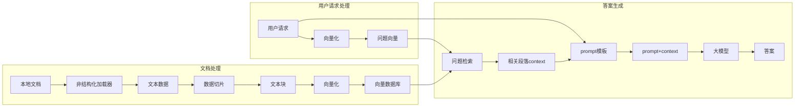
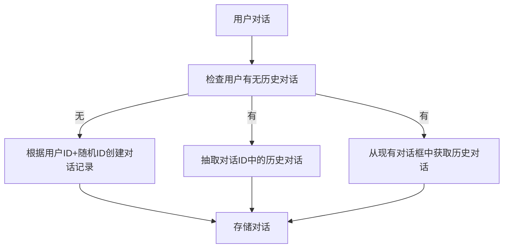

# Detailed Proposal Draft

---

## 1. Background

### 1.1 心理咨询市场

- **供需失衡**：中国心理咨询师缺口大，单次咨询费用普遍在500-1000元区间，形成高门槛服务。
- **地域限制**：专业资源集中在一线城市集中，二三线城市用户获取服务困难。
- **认知滞后**：潜在需求者因"病耻感"回避线下咨询。

### 1.2 竞品报告

- **情智星球**：<https://www.sohu.com/a/830612921_122042791>
- **AI心语**：<https://news.qq.com/rain/a/20241106A09XWS00>

### 1.3 AI's scope

#### Pros

1. **颠覆性的成本结构**：以DeepSeek模型价格为例，每百万Token仅需几块钱，远低于人类心理咨询师价格。且不受地点、时间安排等限制。
2. **实时情绪响应**：7x24在线提供情感支持和安慰，帮助青少年表达和理解自己的情绪。
3. **信息和资源提供**：提供关于心理健康、应对策略等方面的信息。

#### Cons

1. **深层次的情感问题**：如创伤处理、深层次的自我认同问题等，需要专业心理咨询师的介入。
2. **紧急情况**：如自杀倾向、严重的心理危机等，需要即时的专业干预。
3. **法律和医学问题**：如家庭暴力、严重精神疾病等，需要专业的法律和医学介入。
4. **用户认同问题**：LLM无法实现人与人之间的情感链接，用户可能主观上不愿与AI交流心理问题。

### 法律和伦理风险

1. **创伤处理的次生风险**：对PTSD来访者的暴露疗法需要精确把握情绪唤醒度。LLM无法通过生理指标（心率、呼吸频率等）实时调节干预强度，可能导致二次创伤。2023年加拿大某AI咨询平台因此被集体诉讼。
2. **道德判断的算法困境**：面对自杀倾向等危机情况，人类咨询师需要在保密原则与生命权保护间进行价值权衡。LLM的决策受训练数据分布主导，可能产生统计学正确但伦理失当的应对，如过度强调隐私保护而延误危机干预。
3. **责任归属的模糊性**：当AI建议引发不良后果时，责任链条涉及算法开发者、数据提供方、部署机构等多个主体，形成"责任稀释效应"。2021年意大利ChatGPT禁令事件已暴露出此类法律真空。

| ​**Item**​                     | ​**Description**​                                                                                   |
|-------------------------------|---------------------------------------------------------------------------------------------------|
| ​**模型优化**​          | 专注于用 LLM 的能力提供心理咨询服务，而不是训练用于心理咨询的大模型。                            |
| ​**语音**​ | 文字与语音的转化是一个专业性很强的领域，本项目提供基于文本的回复。                               |

### 2.2 做什么

### 不做TTS(Text to Speech)

### 做倾听者

AI倾听情绪输出，给予情绪肯定。

### 做评测工具：心理量表

## Object & Metric

针对心理咨询AI Agent的功能设计，以下是各模块可量化的指标及设计目标建议

| ​**Item**​                     | ​**Description**​                                                                                   |
|-------------------------------|---------------------------------------------------------------------------------------------------|
| ​**心理对话 Chatbot**​    | 根据来访者的需求提供倾听和咨询服务。                                                             |
| ​**心理评测工具**​        | 自动检测实时情绪水平，主动评测心理量表。                                                         |
| ​**隐私政策合规**​          | 参考 HIPAA/GDPR 合规框架标准，实现所有场景的隐私政策覆盖和数据脱敏。                             |

---

## 3. Design(包括工作量评估)

### 3.1 AI 对话

#### 对话流程

#### 用户历史对话服务

#### 运行示例

##### 用户输入：

我是一个港硕，我又要上课又要找实习压力好大。

##### 系统处理流程：

1、检索知识库，寻找案例和应对方法

2、检索用户对话记录

3、通过LLM构建回答

##### 返回结果

👩：

理解你的焦虑，很多同学都有类似经历。试着这样做：

✨ 三步缓解压力 ✨

1. **5-4-3-2-1 正念练习**（现在就可以做）：
   - 说出你看到的5样东西
   - 触摸4种不同材质的物品
   - 听3种声音
   - 闻2种气味
   - 做1个深呼吸
2. **制定学习计划表**（示例）：
   📅 晚7-8点：数学专项
   📅 8:15-9点：英语阅读
   📅 9:15后：自由放松时间

##### 后处理

存储对话

### 3.2 User Profile Feature

Users can view and edit their personal information in the profile section.

### 3.3 Psychological Assessment Feature

The Psychological Assessment feature is mainly designed to help users understand their mental health status through regular assessments, detailed reports, and trend analysis. By combining questionnaire results and chat history analysis, this feature provides users with valuable insights into their emotional state, stress levels, and key concerns over time. And there is another function to read user's real-time mental state.

#### Key Functions

##### 1. Regular Assessments

- Frequency: Monthly assessments for regular users.
- Data Sources:
  - Questionnaire Results: Users complete a psychological questionnaire.
  - Chat History: Analysis of user chat history with the AI assistant.
- Assessment Report:
  - Emotional Score: A sentiment analysis score derived from chat history.
  - Stress Level: A calculated score based on questionnaire responses.
  - Keyword List: A list of high-frequency keywords extracted from chat history (e.g., ["stress", "anxiety"]).

##### 2. Visualization Report

##### 3. Trend Analysis

Trend Analysis function is to identify patterns and trends in the user's mental health status and provide long-term insights to help users track their progress after continuous assessments.

##### 4. Real-time mental state

Real-time mental state function will employ a sentiment score to reflect the user's current mental state, which is derived from the real-time conversation between the AI Agent and the user, and with this score, the system will be able to offer more appropriate content for the user in the community based on their current needs.  In other words, the real-time mental state function enables the three modules of AI dialog, community, and user assessment to interact and produce a more intelligent AI dialog system.

---

#### Technical Implementation

##### 1. Assessment Data

| **Content**         | **Data Source**          | **Technology**                          |
|----------------------|--------------------------|-----------------------------------------|
| Emotional score      | Chat History             | Sentiment analysis by NLP APIs    |
| Stress level         | Questionnaire Results    | Design a psychological questionnaire and calculate stress levels based on user responses|
| High-frequency keyword List| Chat History| Extract keywords using NLP techniques (e.g., NLP API, TF-IDF, LDA)

###### Example

User ID: 12345 | Assessment Date: 2025-03-01  

- Emotional Score: 0.3 (Negative)  
- Stress Level: 7.5 (High)  
- Keyword List: ["stress", "anxiety", "work pressure"]  

###### 2. Trend Analysis

- Emotional Score Trend: [Line Chart]
- Stress Level Trend: [Line Chart]
- Keyword Cloud: [Word Cloud]

###### 3. Real-time mental state

The user's real-time mental state can be evaluated by performing sentiment analysis using NLP on the user chat conversations within a reasonably short time period and context.  

## 4. Roadmap

TODO(@all)

(WANG Xueyao / Features 3.3 and 3.4)

| **Tasks**         | **Estimated completion time**          | **Estimated number of learning hours**                          |
|----------------------|--------------------------|-----------------------------------------|
| User Profile Feature | Progress 1 April 7 | 2-3 Weeks
| Regular Assessments | Progress 2 May 5 | 4 Weeks
| Visualization Report| Progress 3 June 16 | 2 Weeks
| Trend Analysis | Progress 3 June 16  | 2 Weeks
| Real-time mental state | Progress 4 July 7  | 4-6 Weeks

Item Time  
Short proposal February 5  
Detailed Proposal March 10  
Progress 1 April 7  
Progress 2 May 5  
Interim Report & Presentation June 1  
Progress 3 June 16  
Progress 4 July 7  
Webpage July 15  
Project Report July 18  
Oral Examination end of July  
Revised Project Report August 1
