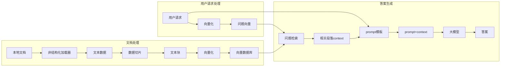
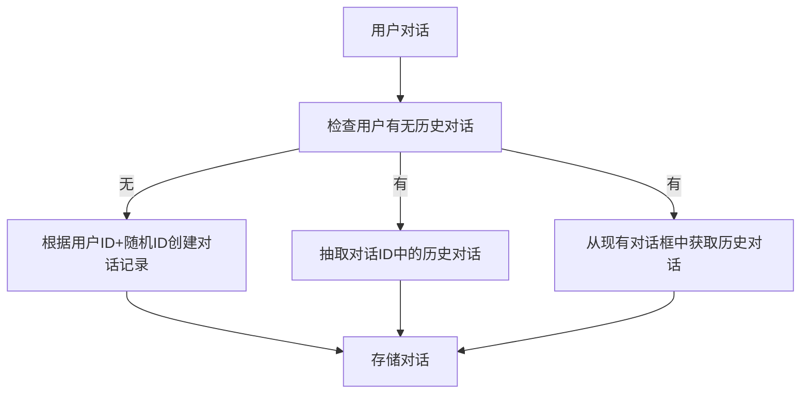
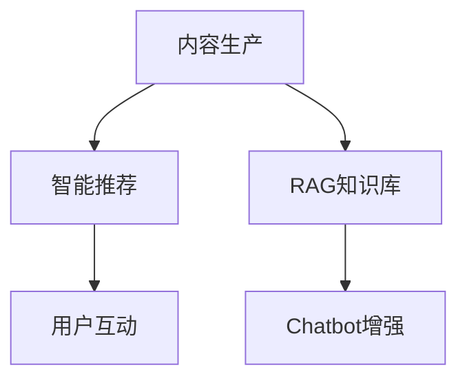
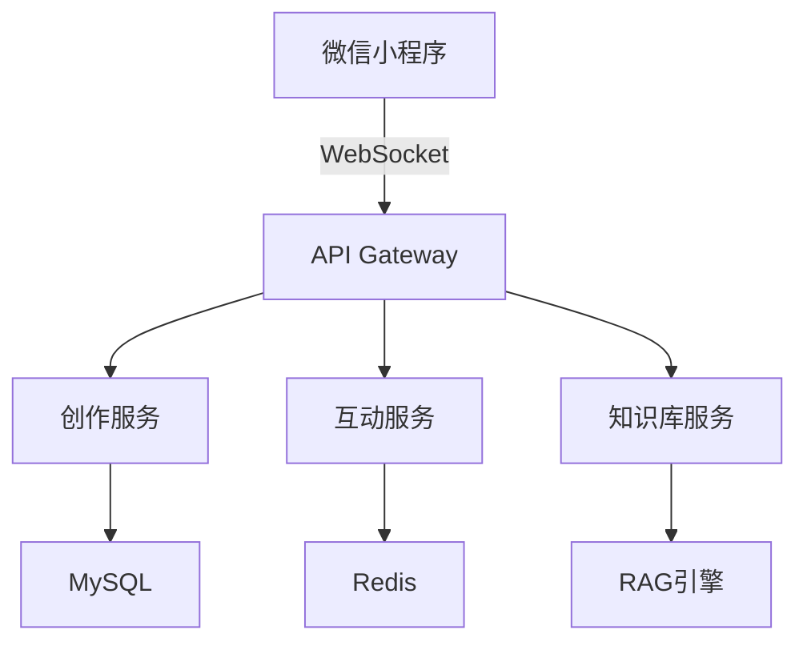
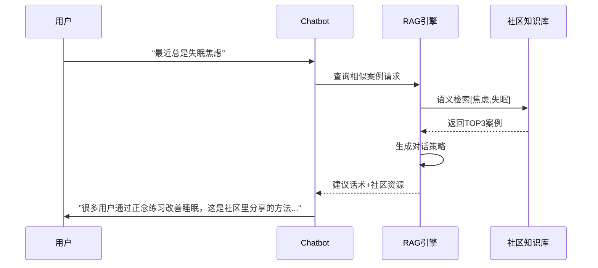

# Detailed Proposal Draft

---

## 1. Background

### 1.1 心理咨询市场

- **供需失衡**：中国心理咨询师缺口大，单次咨询费用普遍在500-1000元区间，形成高门槛服务。
- **地域限制**：专业资源集中在一线城市集中，二三线城市用户获取服务困难。
- **认知滞后**：潜在需求者因"病耻感"回避线下咨询。

### 1.2 竞品报告

- **情智星球**：<https://www.sohu.com/a/830612921_122042791>
- **AI心语**：<https://news.qq.com/rain/a/20241106A09XWS00>

### 1.3 AI's scope

#### Pros

1. **颠覆性的成本结构**：以DeepSeek模型价格为例，每百万Token仅需几块钱，远低于人类心理咨询师价格。且不受地点、时间安排等限制。
2. **实时情绪响应**：7x24在线提供情感支持和安慰，帮助青少年表达和理解自己的情绪。
3. **信息和资源提供**：提供关于心理健康、应对策略等方面的信息。

#### Cons

1. **深层次的情感问题**：如创伤处理、深层次的自我认同问题等，需要专业心理咨询师的介入。
2. **紧急情况**：如自杀倾向、严重的心理危机等，需要即时的专业干预。
3. **法律和医学问题**：如家庭暴力、严重精神疾病等，需要专业的法律和医学介入。
<<<<<<< HEAD
4. **用户认同问题**：LLM的回复有时较为空泛，无法实现人与人之间的情感链接，用户可能主观上不愿与AI交流心理问题。
=======
4. **用户认同问题**：LLM无法实现人与人之间的情感链接，用户可能主观上不愿与AI交流心理问题。
>>>>>>> 8434499 (add content of suyingcheng's commit.)

### 法律和伦理风险

1. **创伤处理的次生风险**：对PTSD来访者的暴露疗法需要精确把握情绪唤醒度。LLM无法通过生理指标（心率、呼吸频率等）实时调节干预强度，可能导致二次创伤。2023年加拿大某AI咨询平台因此被集体诉讼。
2. **道德判断的算法困境**：面对自杀倾向等危机情况，人类咨询师需要在保密原则与生命权保护间进行价值权衡。LLM的决策受训练数据分布主导，可能产生统计学正确但伦理失当的应对，如过度强调隐私保护而延误危机干预。
3. **责任归属的模糊性**：当AI建议引发不良后果时，责任链条涉及算法开发者、数据提供方、部署机构等多个主体，形成"责任稀释效应"。2021年意大利ChatGPT禁令事件已暴露出此类法律真空。

## Scope

### 不做咨询师

### 不做模型优化

### 不做TTS(Text to Speech)

### 做倾听者

AI倾听情绪输出，给予情绪肯定。

### 做内容社区

由用户发帖驱动的日常case、心理学习资源、咨询经历分享。

匿名树洞 + AI情感共鸣 ： 用户可以分享自己的心理困扰、日常情绪或成长故事，LLM 自动生成鼓励性回复或建议（比如“你最近感觉焦虑，试试深呼吸或写日记吧”）。
示例：发布“职场压力”故事的用户，会收到AI整理的相关CBT技巧，并进入“打工人互助小组”聊天室。

### 做评测工具：心理量表。

## Object & Metric

针对心理咨询AI Agent的功能设计，以下是各模块可量化的指标及设计目标建议：

---

### **一、倾听者模块：情绪陪伴与肯定**

1. **情绪识别准确率**  
   - 目标：≥90%的情绪标签精准匹配（基于NLP情感分析）  
   - 指标：与专业心理咨询师标注结果的一致性对比  
   - 参考依据：情智星球的"情绪识别准确性"维度

2. **对话满意度评分**  
   - 目标：用户主观评分≥4.5/5分  
   - 测量：每次对话后嵌入轻量级问卷（如1-2题）  

---

### **二、推荐者模块：资源精准匹配**

1. **推荐准确率**  
   - 目标：≥85%的资源推荐符合用户当前心理状态  
   - 算法依据：结合用户画像（如MBTI/Big5）与动态情绪数据  

2. **资源采纳率**  
   - 目标：推荐资源的点击率≥70%，咨询师匹配点击率≥60%  
   - 优化方向：基于用户行为数据的协同过滤算法迭代  

3. **群体匹配有效性**  
   - 目标：用户加入群体后30天留存率≥50%  
   - 评估：通过群体互动频率与情绪改善指标交叉验证  

---

### **三、评测工具模块：科学评估体系**

1. **心理测评一致性**  
   - 目标：与专业量表结果相关性≥0.85  
   - 对标案例：情智星球六维指数与经典量表的融合设计

2. **评测完成率**  
   - 目标：用户首次测评完成率≥80%，月度复测率≥40%  
   - 优化策略：游戏化引导（如进度条、成就徽章）  
   - 参考机制：情智星球无感对话式测评设计

---

### **四、扩展性指标**

1. **系统响应时效**  
   - 目标：情绪危机识别到干预建议生成≤3秒

2. **用户留存周期**  
   - 目标：30天留存率≥40%，反映产品粘性

3. **政策、伦理合规**  
   - 目标：隐私政策覆盖率100%，数据脱敏率100%  
   - 参考标准：HIPAA/GDPR合规框架

---

## 3. Design(包括工作量评估)

### 3.1 AI 对话

#### 对话流程




#### 用户历史对话服务



#### 运行示例

##### 用户输入：

我是一个港硕，我又要上课又要找实习压力好大。

##### 系统处理流程：

1、检索知识库，寻找案例和应对方法

2、检索用户对话记录

3、通过LLM构建回答

##### 返回结果

👩：

理解你的焦虑，很多同学都有类似经历。试着这样做：

✨ 三步缓解压力 ✨

1. **5-4-3-2-1 正念练习**（现在就可以做）：
   - 说出你看到的5样东西
   - 触摸4种不同材质的物品
   - 听3种声音
   - 闻2种气味
   - 做1个深呼吸
2. **制定学习计划表**（示例）：
   📅 晚7-8点：数学专项
   📅 8:15-9点：英语阅读
   📅 9:15后：自由放松时间

##### 后处理

存储对话

### 3.2 社区

#### 核心功能架构



#### 功能实现细节

##### 核心功能模块

| 功能维度     | 核心能力说明                                          | 预计工作量    | 预计交付  |
| ------------ | -------------------------------------------------- |------------ |------------ |
| **内容创作** | 支持富文本+匿名模式编辑，支持富文本展示                  | 4 week | Progress 1 April 7 |
| **社区互动** | 匿名点赞/评论系统                                     | 4 week | Progress 2 May 5 |
| **智能推荐** | 基于用户心理画像的个性化推荐（结合实时情绪状态+长期兴趣标签） | 4 week | Progress 3 June 16 |
| **知识沉淀** | 自动生成结构化案例库，用于增强 Chatbot 对话效果           | 4 week | Progress 4 July 7 |

##### 整体技术实现方案



##### Chatbot集成方案(RAG增强流程)



##### 内容搜索和推荐方案

TODO(@xuhanlin)

#### 运行效果示例

##### 心理历程分享

```markdown
**匿名用户@高考复读**: 
"⬆️ 内耗三个月后终于决定再战了！分享我的心理重建过程：
1️⃣ 每天写『成就日记』对抗自我否定
2️⃣ 参加线下心理支持小组
3️⃣ 阅读《自卑与超越 /》获得力量
👉 想知道大家如何走出失利阴霾？"

```

##### 学习资源分享

```markdown
**认证咨询师@李医生**: 
"【专业资源】最新发布的CBT疗法自助手册包含：
- 自动思维记录表模板
- 行为激活周计划表
- 10分钟正念练习音频
支持导出PDF格式，欢迎取用❤️"

```

##### Chatbot交互案例

```markdown
用户: 觉得最近所有人都讨厌我...
Chatbot: 
"这种被孤立感确实很难受呢（共情），社区里有很多类似经历的朋友：
1️⃣ @匿名用户 通过每日感恩练习改善人际关系认知
2️⃣ @小白 参加社交焦虑训练营的经验分享
需要我为你详细解读这些方法吗？"
```

### 3.3 User Profile Feature

Users can view and edit their personal information in the profile section.

### 3.4 Psychological Assessment Feature

The Psychological Assessment feature is designed to help users understand their mental health status through regular assessments, detailed reports, and trend analysis. By combining questionnaire results and chat history analysis, this feature provides users with valuable insights into their emotional state, stress levels, and key concerns over time.

#### Key Functions

##### 1. Regular Assessments
- Frequency: Monthly assessments for regular users.
- Data Sources:
  - Questionnaire Results: Users complete a psychological questionnaire.
  - Chat History: Analysis of user chat history with the AI assistant.
- Assessment Report:
  - Emotional Score: A sentiment analysis score derived from chat history.
  - Stress Level: A calculated score based on questionnaire responses.
  - Keyword List: A list of high-frequency keywords extracted from chat history (e.g., ["stress", "anxiety"]).

##### 2. Visualization Report


##### 3. Trend Analysis
- Identify patterns and trends in the user's mental health status and provide long-term insights to help users track their progress after continuous assessments.
---

#### Technical Implementation

###### Assessment Data
| **Content**         | **Data Source**          | **Technology**                          |
|----------------------|--------------------------|-----------------------------------------|
| Emotional score      | Chat History             | Sentiment analysis by NLP APIs    |
| Stress level         | Questionnaire Results    | Design a psychological questionnaire and calculate stress levels based on user responses|
| High-frequency keyword List| Chat History| Extract keywords using NLP techniques (e.g., NLP API, TF-IDF, LDA).
 |


##### Example

###### User ID: 12345 | Assessment Date: 2025-03-01

###### Emotional Score: 0.3 (Negative)
###### Stress Level: 7.5 (High)
###### Keyword List: ["stress", "anxiety", "work pressure"]


###### Trend Analysis
- Emotional Score Trend: [Line Chart]
- Stress Level Trend: [Line Chart]
- Keyword Cloud: [Word Cloud]


## 4. Roadmap

TODO(@all)

Item Time
Short proposal February 5
Detailed Proposal March 10
Progress 1 April 7
Progress 2 May 5
Interim Report & Presentation June 1
Progress 3 June 16
Progress 4 July 7
Webpage July 15
Project Report July 18
Oral Examination end of July
Revised Project Report August 1
