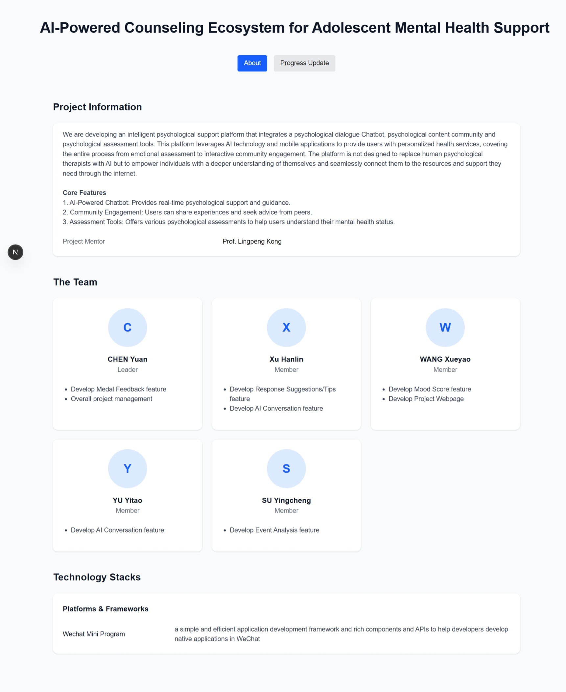
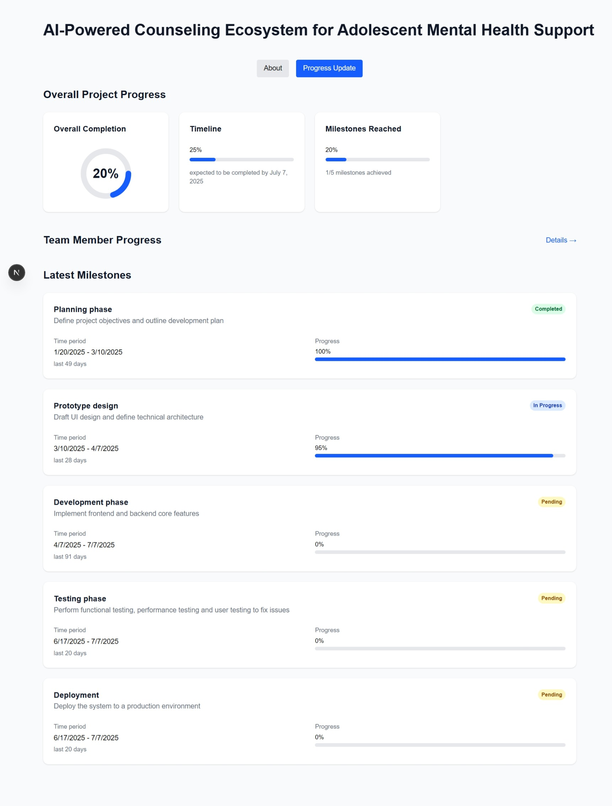

# Progress 1 Update: WANG Xueyao

This document summarizes my *Progress Update 1* for the capstone project "AI-Powered Counseling Ecosystem for Adolescent Mental Health Support".

## 1. Achievements

### **Task 1: Project Webpage Development**

- Designed and implemented the project webpage to present project details in an easy-to-understand manner, enabling the Project Mentor to closely monitor progress through the webpage.

## 2. Ongoing Tasks

### **Task 2: Mood Score Feature Development**

The goal of this feature is to display the results of sentiment analysis and provide user feedback. Key functionalities include:

- Displaying the sentiment category and intensity chart during conversations.
- Allowing users to provide feedback on sentiment results via "✓/✗/Edit" options.
- Synchronizing feedback data with the backend (Mock implementation).
- Supporting historical sentiment changes on the personal homepage.

**Progress**:  
I have completed the preliminary technical research for this feature and will begin implementation in the next phase.

## 3. Future Tasks

### **Task 3: Project Webpage Hosting**

- Host the project webpage on the designated project account once the account information is received from the office.

## 4. Challenges Encountered

- None at this stage.

## 5. Conclusion

The previous phase focused on web design, while feature development will be my next priority. Overall, I am making steady progress on the project as planned by the team.
