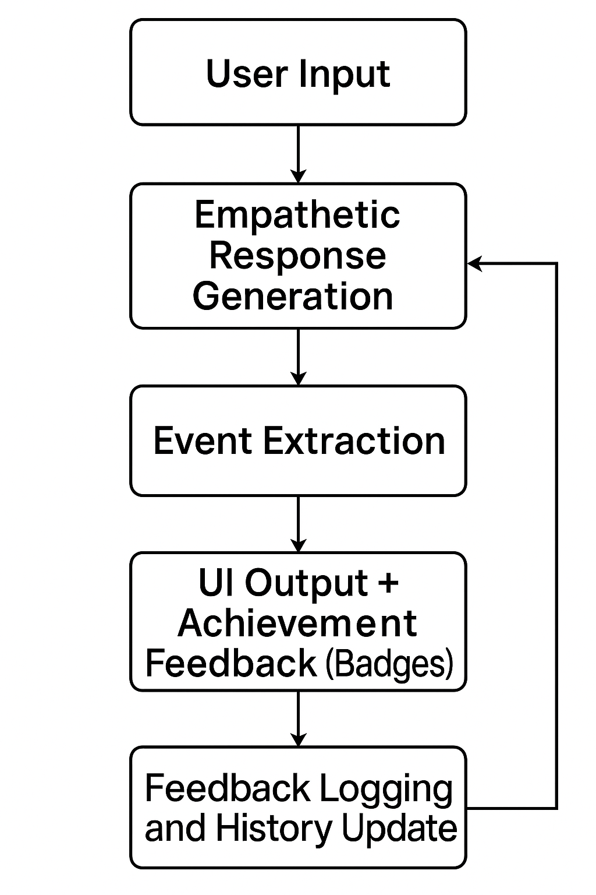

# Design Functionality and Creativity Overview

## 1. Application Category

Zhiji AI Assistant is a WeChat Mini Program designed to provide non-clinical emotional support through natural language interaction. It leverages large language models (LLMs) to serve adolescent users in managing and reflecting on their emotions. This application falls under the following categories:

- Mental Health Chatbot
- Lightweight Emotional Wellness Platform

## 2. Motivation

### 2.1 Social Context

The psychological service industry in China suffers from a significant supply-demand gap. Professional resources are mostly concentrated in tier-one cities, and the average cost per session remains prohibitively high (approx. ¥500–¥1000). Additionally, traditional cultural values often stigmatize mental health discussions, deterring users from seeking offline assistance.

### 2.2 Technological Opportunity

With the rapid development of large language models such as GPT-4 and DeepSeek, it has become feasible to simulate the role of an empathetic emotional companion, especially in non-medical contexts. LLMs provide:

- Low-cost and accessible emotional support
- Timely, always-available empathetic interaction
- Structured detection of emotional and cognitive cues

## 3. System Design

### 3.1 Processing Pipeline

User input is processed through parallel LLM-based modules and then synthesized to generate both empathetic and actionable responses:

```
[ User Input ]
↓
[ Empathetic Response Generation ] ←→ [ Event Extraction ]
↓
[ UI Output + Achievement Feedback (Badges) ]
↓
[ Feedback Logging and History Update ]
```

 *Figure 1: System architecture diagram*



### 3.2 User Interface Layout

The design adopts an instant messaging style interface to maximize user familiarity. The layout includes:

- **Top navigation bar**: Access to history, emotion review, and badge panel
- **Main conversation area**: User and AI messages
- **Input box**: For free-text message composition

 *Figure 2: UI sketch * 


## 4. Features

### 4.1 Functional Modules

| Module              | Description                                               |
| ------------------- | --------------------------------------------------------- |
| Emotion Recognition | Classifies emotion types and intensity from user messages |
| Empathetic Response | Generates non-judgmental supportive feedback              |
| Event Extraction    | Identifies psychologically significant event elements     |
| Badge System        | Rewards users for positive cognitive reflection           |

*Figure 3: Badge system and Event system UI* 


### 4.2 Technical Implementation

| Component     | Technology Stack                       |
| ------------- | -------------------------------------- |
| Frontend      | WeChat Mini Program (WXML + WXSS + JS) |
| Backend       | Flask (Python microservice framework)  |
| AI Models     | Meta-Llama-3.1-8B-Instruct             |
| Data Security | Local storage                          |
