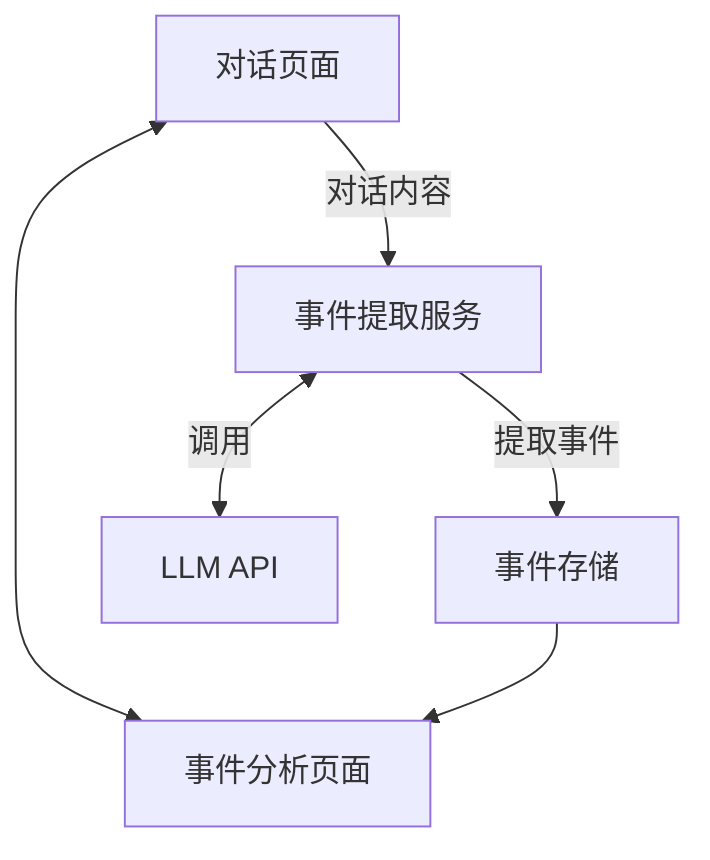
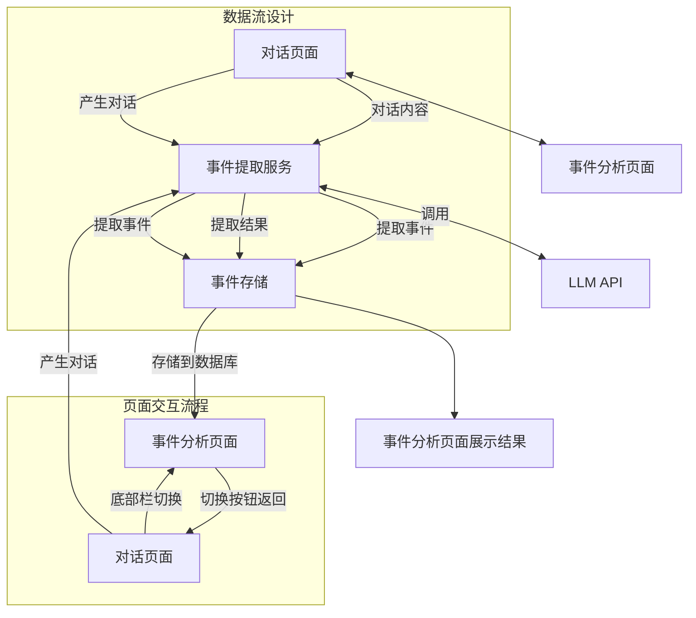
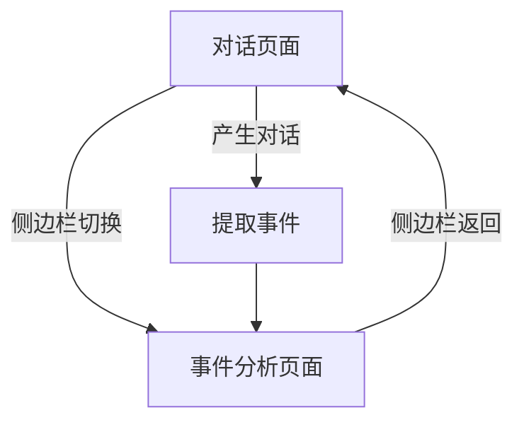

# Progress1-小程序事件分析 feature 文档

## 架构设计：

### 事件提取服务层（Service Layer）

- 定义统一的事件提取接口

- 现阶段使用 Mock 数据

- 未来可以无缝切换到真实的 LLM 服务

### 数据模型层（Model Layer）

- 事件数据结构定义
- 对话数据结构定义
- 事件状态管理
### 页面交互层（View Layer）
- 事件列表页面（当前已实现）
- 页面间导航
- 事件更新机制

##数据流设计

数据流流向：对话页面 -> 事件提取服务（后端调用LLM API） -> 事件存储 -> 事件列表展示

## 页面交互流程

**页面切换逻辑**：

- 用户可以通过小程序底部栏的切换按钮，在 **对话页面** 和 **事件分析页面** 之间自由跳转。
- 底部栏是双向连接机制：
  - 在 **对话页面**，点击底部栏按钮即可跳转到 **事件分析页面**。
  - 在 **事件分析页面**，点击切换按钮可返回到 **对话页面**。

**对话内容的产生**：

- 用户在 **对话页面** 中进行输入和互动时，会产生对话内容（文本数据）。
- 这些对话内容将作为输入，传递给 **事件提取服务**。

**事件提取服务的调用**：

- 当用户在 **对话页面** 完成输入后，触发事件提取功能。
- 事件提取服务负责对对话内容进行处理，提取出关键事件，并将提取结果返回。

**事件存储与结果展示**：

- 提取的事件会存储到后端数据库，以便后续使用。
- 在用户切换到 **事件分析页面** 时，已存储的事件数据将被加载并以卡片形式展示，注意这里是分页查询，每页5个事件。

**可视化流程**：

- **对话页面**是用户与模型交互的入口，产生对话内容并触发事件提取。
- **事件分析页面**则是结果展示的终点，用户可以查看分析后的事件卡片，并进一步筛选或刷新内容

## 开发步骤规划

### **第一阶段：基础框架**

- 目标：为事件分析页面构建基本框架。

  1. 完善事件卡片组件：

     - 定义事件卡片所需的数据结构（如标题、时间、描述等）。
     - 实现卡片的静态展示。
     
  2. 页面切换逻辑：

     - 实现对话页面与事件分析页面的切换功能。
     - 使用底部导航栏或按钮切换页面。
     
  3. 设计 Mock 数据结构：
  
     - 定义事件数据的 Mock 结构，确保模拟的数据能覆盖真实场景。

### **第二阶段：Mock API**

- 目标：模拟事件提取服务和后端接口。

  1. 实现 Mock 服务层：

     - 模拟事件提取服务的调用（如返回固定的事件卡片数据）。
     - 模拟事件存储和读取接口。
     
  2. 添加事件状态管理：

     - 使用状态管理工具（如 Redux 或 Context）管理事件数据。

  3. 完善错误处理：

     - 设计错误提示，处理 Mock 服务层的异常情况。

### **第三阶段：UI 交互**

- 目标：优化事件分析页面的交互体验。

  1. 添加加载状态：

     - 在事件数据加载时，显示加载动画。

  2. 实现下拉刷新：

     - 支持用户手动刷新事件数据。

  3. 添加筛选功能：

     - 根据事件类型、时间范围等进行筛选。

### **第四阶段：API 集成准备**

- 目标：为接入后端 API 做好准备。

  1. 设计实际 API 接口：

     - 确定事件提取服务和事件存储的接口格式（如请求和响应的数据结构）。

  2. 编写 API 调用层：

     - 编写与后端交互的代码（如 Axios 调用）。

  3. 准备测试用例：

     - 编写单元测试和集成测试，确保接口调用的正确性

### 第四阶段：API 集成实现计划（预计5天）

#### 1. 后端服务实现（2天）

1. 事件提取服务

- 创建 server/service/event_service.py

- 实现核心事件提取逻辑

- 集成 LLM API 调用

- 设计基础 Prompt 模板

1. 数据库操作

- 在 server/dao 下添加事件相关操作

- 实现基本的 CRUD 功能

#### 2. API 接口实现（1天）  

1. 核心接口

- 事件提取：POST /api/events/extract

- 事件列表：GET /api/events

- 事件详情：GET /api/events/{id}

1. 接口文档

- 简单记录接口格式和数据结构

#### 3. LLM 集成（1天）

1. Prompt 设计

- 在 server/prompt 下实现事件提取 Prompt

- 配置 LLM API 调用

1. 服务配置

- 配置 API 密钥

- 实现基础错误处理

#### 4. 前端集成（1天）

1. API 调用实现

- 替换 Mock 数据

- 实现基础 API 调用

- 添加简单错误处理

1. 状态管理

- 更新事件状态管理

- 实现基础数据更新

### 关键交付物

1. 可用的事件提取服务

1. 基础的 API 接口

1. 与 LLM 的集成

1. 前端与后端的连接

### 开发进度跟踪：

5.2 截止下一步计划：

 后端开发

 week2: 0419 - 0425
 数据库设计（MongoDB/MySQL）

 使用 Web 开发框架搭建后端

 设计和调试 Prompt，对接LLM API

 集成测试

 week3:0426-0502

 模拟青少年高频场景，完成全流程测试，输出测试用例报告
 预留时间识别和修复bug
