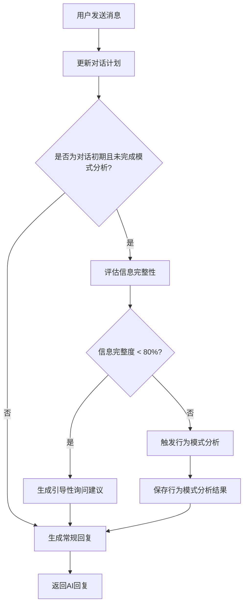

# 引导性询问和行为模式分析模块

## 概述

本模块为心理咨询聊天服务添加了智能的引导性询问和行为模式分析功能。在对话初始阶段，系统会自动评估信息完整性，并在需要时进行引导性询问，最终分析用户的行为模式以提供更精准的心理支持。

## 核心功能

### 1. 引导性询问（Guided Inquiry）

**目标**: 在对话初期系统性地收集用户的心理状态信息

**工作机制**:
- 自动评估当前对话中信息的完整性（0-100%）
- 当信息完整度低于80%时，自动生成引导性问题
- 按照标准化框架收集信息：基础情况了解 → 起因探索 → 经过分析 → 结果评估

**询问框架**:
1. **基础情况了解**: 事件的基本信息（时间、地点、涉及人员）
2. **起因探索**: 触发因素、事件背景、类似经历
3. **经过分析**: 事件发展过程、当时的想法感受、采取的行动
4. **结果评估**: 事件结果、影响评估、当前看法

### 2. 行为模式分析（Behavior Pattern Analysis）

**目标**: 基于收集到的完整信息，分析用户的心理和行为模式

**分析维度**:
- **触发模式**: 常见触发情境、强度、频率
- **认知模式**: 思维方式、认知偏差、核心信念
- **情绪模式**: 情绪反应类型、调节方式、持续时间
- **行为模式**: 应对策略、行为有效性、习惯倾向
- **人际模式**: 互动方式、支持系统利用、社交行为
- **资源模式**: 个人优势、成功经验、成长潜力

## 技术实现

### 文件结构

```
server/
├── prompt/
│   ├── guided_inquiry_prompt.txt      # 引导性询问提示模板
│   └── pattern_analysis_prompt.txt    # 行为模式分析提示模板
├── service/
│   ├── chat_service.py                # 主要服务类（已修改）
│   ├── guided_inquiry_example.py      # 使用示例
│   └── README_guided_inquiry.md       # 本文档
└── data/
    ├── plans/                         # 对话计划存储
    └── patterns/                      # 行为模式分析结果存储
```

### 新增方法

#### ChatService类新增方法:
- `_load_guided_inquiry_prompt()`: 加载引导性询问提示模板
- `_load_pattern_analysis_prompt()`: 加载行为模式分析提示模板
- `_assess_information_completeness()`: 评估信息完整性
- `_analyze_behavior_pattern()`: 分析行为模式
- `_get_pattern()` / `_save_pattern()`: 模式数据的读写操作

### 数据结构

#### 引导性询问结果 (inquiry_result):
```json
{
    "need_inquiry": true/false,
    "current_stage": "基础情况了解/起因探索/经过分析/结果评估/信息充分",
    "missing_info": ["缺失的信息类型"],
    "suggested_questions": ["建议的问题1", "建议的问题2"],
    "information_completeness": 0-100,
    "reason": "需要或不需要询问的原因"
}
```

#### 行为模式分析结果 (pattern_analysis):
```json
{
    "pattern_analysis": {
        "trigger_patterns": {
            "common_triggers": ["触发因素1", "触发因素2"],
            "trigger_intensity": "低/中/高",
            "trigger_frequency": "偶发/经常/持续"
        },
        "cognitive_patterns": {
            "thinking_styles": ["思维特征1", "思维特征2"],
            "cognitive_biases": ["认知偏差1", "认知偏差2"],
            "core_beliefs": ["核心信念1", "核心信念2"]
        },
        // ... 其他模式维度
    },
    "pattern_summary": "对整体行为模式的简要总结",
    "key_insights": ["关键洞察1", "关键洞察2"],
    "consultation_recommendations": ["建议1", "建议2"]
}
```

## 使用方法

### 基本使用

```python
from service.chat_service import ChatService

# 初始化服务
chat_service = ChatService()

# 获取AI回复（会自动进行引导性询问和模式分析）
response = chat_service.get_response(
    message="用户的消息",
    history=conversation_history,
    session_id="unique_session_id"
)

# 检查是否有引导性询问结果
if 'inquiry_result' in response:
    inquiry = response['inquiry_result']
    if inquiry['need_inquiry']:
        print("建议的引导性问题:", inquiry['suggested_questions'])

# 检查是否完成了行为模式分析
if 'pattern_analysis' in response:
    pattern = response['pattern_analysis']
    print("行为模式分析完成")
    print("关键洞察:", pattern['key_insights'])
    print("咨询建议:", pattern['consultation_recommendations'])
```

### 运行示例

```bash
cd server/service
python guided_inquiry_example.py
```

## 工作流程



## 特性优势

1. **智能化**: 自动判断何时需要引导性询问，避免过度询问
2. **结构化**: 按照专业心理咨询框架收集信息
3. **个性化**: 基于行为模式分析提供针对性建议
4. **可扩展**: 模块化设计，易于扩展和维护
5. **数据驱动**: 所有分析结果都可持久化存储，支持长期跟踪

## 配置要求

- 需要配置OpenAI API密钥和相关环境变量
- 确保 `server/data/plans/` 和 `server/data/patterns/` 目录有写入权限
- 推荐使用GPT-4或类似的高质量语言模型以获得最佳分析效果

## 注意事项

1. **隐私保护**: 行为模式分析结果包含敏感信息，需要妥善保管
2. **专业边界**: 系统提供的是支持性建议，不能替代专业心理治疗
3. **错误处理**: 当API调用失败时，系统会优雅降级，不影响基础对话功能
4. **性能考虑**: 行为模式分析需要额外的API调用，可能会增加响应时间

## 未来扩展

- 支持多轮次的行为模式分析和更新
- 集成更多心理评估工具
- 添加可视化的模式分析报告
- 支持团体咨询场景的模式分析 